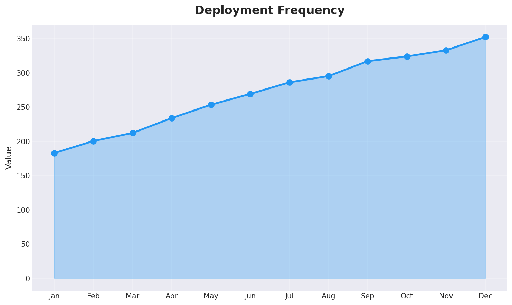
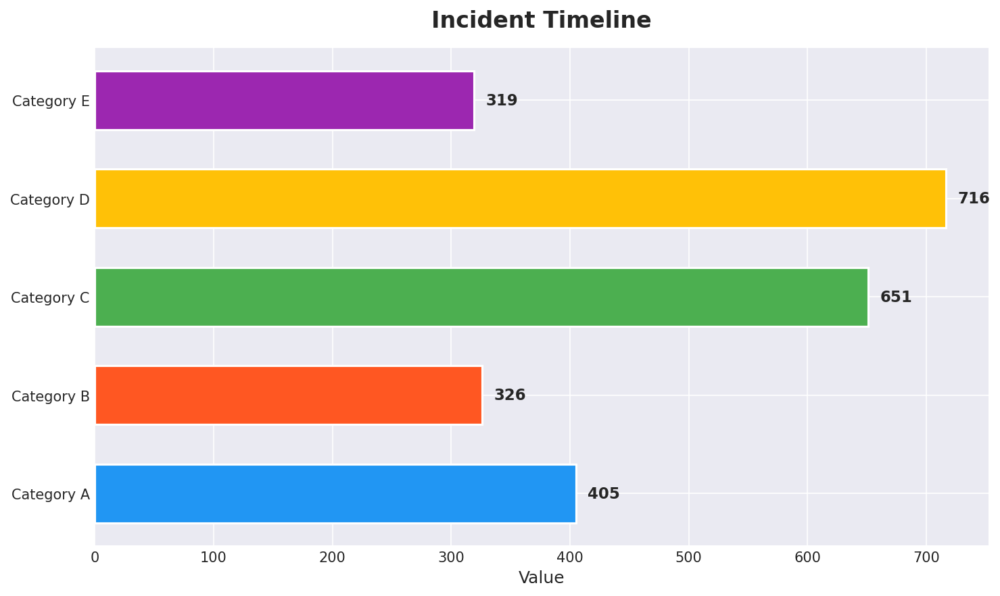
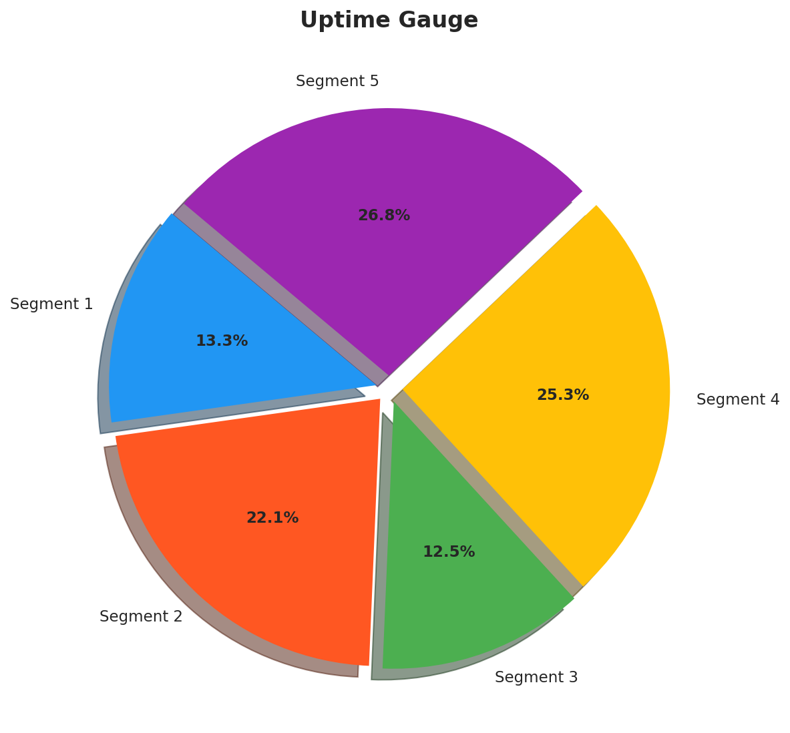
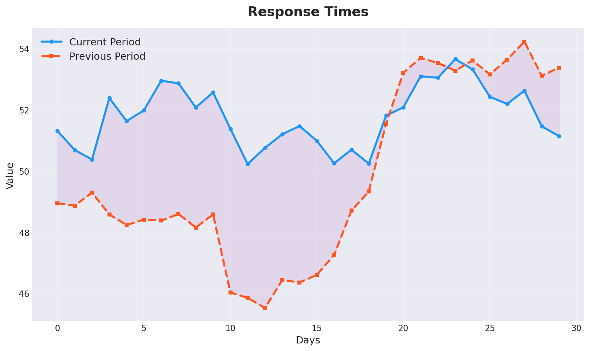

# DevOps Monitoring Dashboard

A Streamlit dashboard for monitoring deployment frequency, incident timeline, uptime, and response times.

## Features

* Deployment frequency chart
* Incident timeline chart
* Uptime gauge chart
* Response times chart

## Screenshots

## Requirements

* Python 3.8+
* Streamlit
* Pandas
* Plotly
* Matplotlib
* NumPy

## Installation

1. Clone the repository: `git clone https://github.com/username/devops-monitoring-dashboard.git`
2. Install the requirements: `pip install -r requirements.txt`
3. Run the dashboard: `streamlit run app.py`

## Usage

1. Select a page from the sidebar
2. View the corresponding chart

## Contributing

Pull requests and issues are welcome. Please see the [contributing guidelines](CONTRIBUTING.md) for more information.